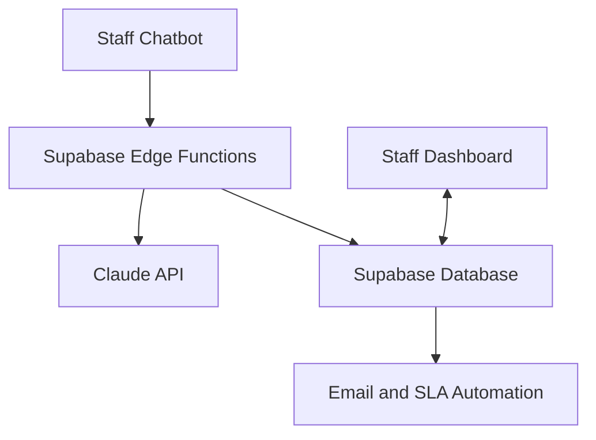

# MaryCo IT Support System

An AI-assisted operation support chatbot and real-time administrative dashboard developed as a demonstration solution for a community-service organisation.

## Live Demo

* **Staff IT Support Chatbot:** [Open chatbot](https://maryco-it-support.netlify.app/)
* **IT Administration Dashboard:** [Open dashboard](https://maryco-it-dashboard.netlify.app/)

> The dashboard is restricted to authorised demonstration accounts. Use the following demo account to explore the dashboard:
- **Email:** `demo@maryco-portfolio.com`
- **Password:** `MaryCoDemo2026!`
The account provides access only to fictional demonstration data. Administrative actions and data modifications are disabled.

## Project Overview

MaryCo IT Support is a two-part internal support system designed for non-technical and time-poor staff. It helps users resolve common technology issues through an AI-assisted chatbot and allows unresolved problems to be submitted as support tickets.

Submitted tickets are stored in a Supabase PostgreSQL database and displayed in a separate administrative dashboard. Authorised staff can monitor incoming cases, update ticket statuses, review support activity and track operational performance.

## Business Problem

Small not-for-profit organisations may have limited IT resources while employees still require timely support with workplace technology. Manual support processes can make it difficult to consistently record requests, monitor unresolved issues and identify recurring problems.

This project demonstrates how how an integrated chatbot and dashboard could:

* Provide immediate guidance for common IT issues
* Reduce repetitive support enquiries
* Standardise ticket collection
* Improve visibility of unresolved requests
* Support faster prioritisation and follow-up
* Identify recurring support issues through dashboard insights

## Key Features

### Staff Chatbot

* AI-assisted troubleshooting through Anthropic Claude
* Guidance for Microsoft 365, printers, laptops, Cisco AnyConnect, projectors and account security
* Guided collection of issue details
* Automatic support-ticket creation
* Unique case numbers such as `MC-1001`
* Links between the chatbot and staff dashboard
* Responsive interface for desktop and mobile devices

### Administration Dashboard

* Secure staff authentication through Supabase
* Real-time display of submitted tickets
* Search and filtering by status, priority and category
* Ticket status and priority updates
* Operational summary cards and insights
* Notification monitoring
* Supply-request tracking
* Automatic refresh with a polling fallback

### Automation and Notifications

* Secure ticket submission through Supabase Edge Functions
* Email notifications through Google Apps Script and MailApp
* Hourly SLA monitoring
* Identification of unresolved requests requiring escalation

## Technology Stack

| Component               | Technology                            |
| ----------------------- | ------------------------------------- |
| Frontend                | HTML, CSS and JavaScript              |
| Database                | Supabase PostgreSQL                   |
| Authentication          | Supabase Auth                         |
| Real-time updates       | Supabase Realtime                     |
| Backend functions       | TypeScript and Deno                   |
| Artificial intelligence | Anthropic Claude API                  |
| Email notifications     | Google Apps Script and MailApp        |
| Automation              | Supabase Edge Functions and `pg_cron` |
| Hosting                 | Netlify                               |
| Version control         | GitHub                                |

## System Architecture



## Supabase Components

### Database Tables

* `staff` — authorised dashboard users
* `cases` — submitted IT support tickets
* `queries` — chatbot questions and responses
* `orders` — workplace supply requests
* `notification_rules` — notification configuration
* `email_log` — email delivery history

### Edge Functions

* `super-function` — securely communicates with the Claude API
* `support-submit` — validates and records support requests
* `sla-check` — checks unresolved cases against SLA conditions

### Scheduled Task

* `sla-hourly` — runs the SLA check every hour

## Project Structure

```text
maryco-it-support-system/
├── maryco-chatbot-secure.html
├── maryco-dashboard-auth.html
├── schema.sql
├── supabase/
│   └── functions/
│       ├── super-function/
│       │   └── index.ts
│       ├── support-submit/
│       │   └── index.ts
│       └── sla-check/
│           └── index.ts
├── README.md
└── .gitignore
```

## Security and Privacy

* Dashboard access is restricted through Supabase Authentication.
* Database access is controlled using Row Level Security.
* Claude API credentials are stored as Supabase Edge Function secrets.
* Service-role keys, passwords, webhook tokens and API secrets are excluded from this repository.
* The frontend uses only the browser-safe Supabase project URL and publishable key.
* All demonstration records are fictional and non-identifying.
* No real client, staff or organisational information is included.

## Skills Demonstrated

* Business problem analysis
* User-focused solution design
* Database design using SQL
* API integration
* Authentication and access control
* Real-time dashboard development
* Workflow automation
* AI chatbot integration
* Testing and troubleshooting
* Cloud deployment
* Technical documentation

## Disclaimer

This is an independent demonstration prototype created for a GdAI Hack Day project. It is not an official production system of Mary’s House Services and does not contain real client or organisational data.
